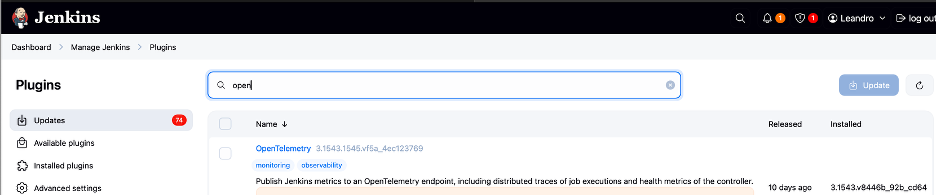
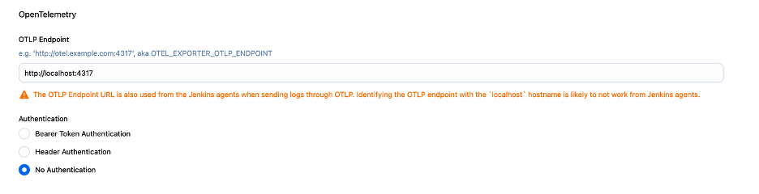
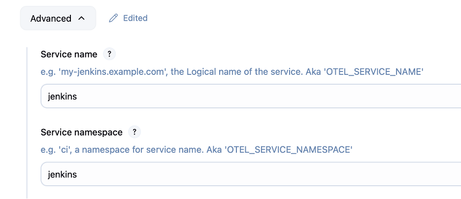
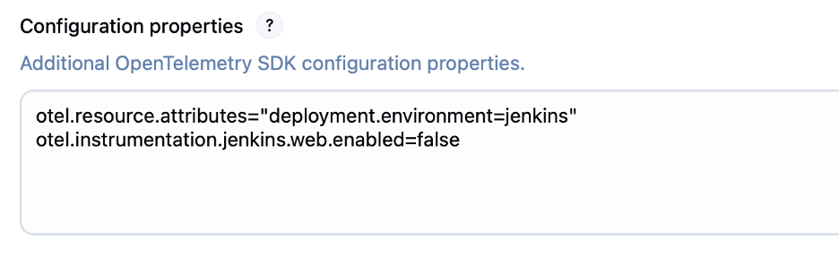
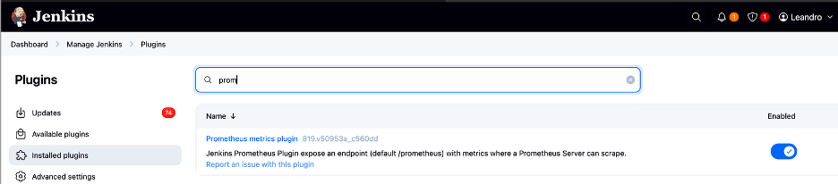
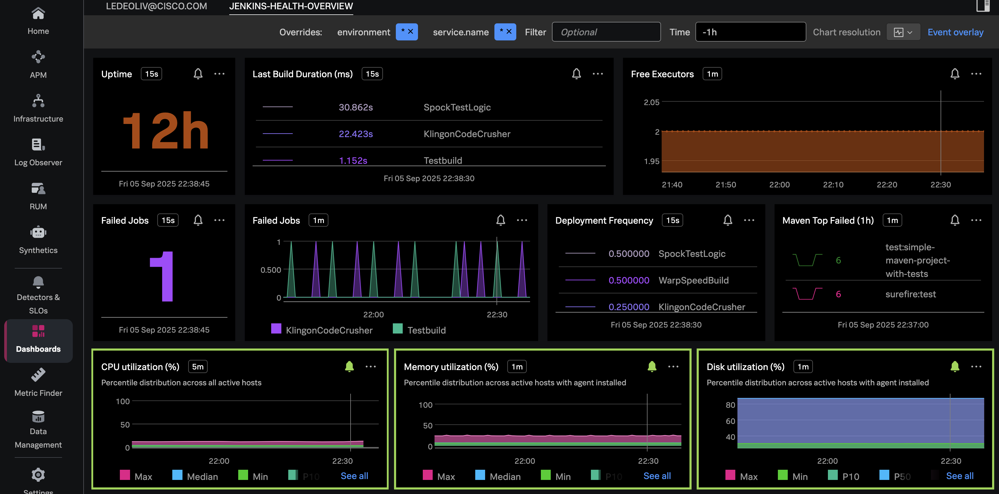

<xaiArtifact artifact_id="aaf0030e-7e8a-47ec-8901-646eac81b765" artifact_version_id="b41c46cc-82dd-4f74-a224-86dd5fb7811f" title="README.md" contentType="text/markdown">

# Instrumenting Pipelines

This repository contains the implementation used to demonstrate the OBS1336 session at .conf 2025. It showcases how to instrument Jenkins and Maven to send telemetry to Splunk Observability Cloud.

## Advantages
- Monitor and analyze Jenkins and Maven performance
- Gain insights into pipeline execution with Splunk Observability Cloud
- Easy setup with OpenTelemetry integrations

## Prerequisites
- Jenkins
- Maven
- Splunk Observability Cloud Access  
  If you don’t have an instance, create a trial [here](https://www.splunk.com/en_us/download/o11y-cloud-free-trial.html).

## Install Splunk OTEL Collector
Use the Splunk Observability Cloud wizard to generate the collector installation command, or run the following command, replacing your connection details as needed:

```bash
curl -sSL https://dl.signalfx.com/splunk-otel-collector.sh > /tmp/splunk-otel-collector.sh && \
sudo sh /tmp/splunk-otel-collector.sh --realm <your realm> -- <>your token> --mode agent --without-instrumentation --discovery

```

## Configure the Splunk Collector
1. Navigate to `/etc/otel/collector`
2. Replace `agent_config.yaml` with the contents of `otel-collector/agent_config.yaml` from this repository.
3. Restart the collector and verify it is running correctly.

```bash
here to stop and start the collector
```

## Install the OpenTelemetry Plugin in Jenkins
1. In the Jenkins plugin section, locate and install the **OpenTelemetry Plugin**.



2. After installation, go to **Manage Jenkins > System** and configure the plugin.








## Install the Prometheus Exporter in Jenkins
1. In the Jenkins plugin section, locate and install the **Prometheus Exporter Plugin**.



## Install the Maven Plugin

The documentation  [here](https://github.com/open-telemetry/opentelemetry-java-contrib/blob/main/maven-extension/README.md) proveides more than form of installation.

We will use the following method:

1. Copy the JAR to the Maven extensions path:
   ```bash
   mvn dependency:copy -Dartifact=io.opentelemetry.contrib:opentelemetry-maven-extension:1.46.0-alpha
   ```
2. Add the plugin to your maven task
   ```bash
   example

   mvn -Dmaven.ext.class.path=target/dependency/opentelemetry-maven-extension-1.46.0-alpha.jar clean package

   ```

## Test
Import one of the sample jobs from the repository’s folder or use your own to test the integrations. You should start seeing telemetry data in the Jenkins environment in Splunk Observability Cloud.

## Dashboards
This repository includes sample dashboards to help you start observing your Jenkins environment.



## References
- **Splunk Blog**: [Jenkins OpenTelemetry Observability](https://www.splunk.com/en_us/blog/devops/jenkins-opentelemetry-observability.html)
- **Splunk Repository**: [splunk-jenkins-otel](https://github.com/splunk/splunk-jenkins-otel)
- **Maven Plugin Documentation**: [OpenTelemetry Maven Extension](https://github.com/open-telemetry/opentelemetry-java-contrib/blob/main/maven-extension/README.md)
- **Jenkins OpenTelemetry Plugin**: [Jenkins OTel Plugin](https://plugins.jenkins.io/opentelemetry/)

## Contact
For questions, reach out to Leandro or open an issue

</xaiArtifact>